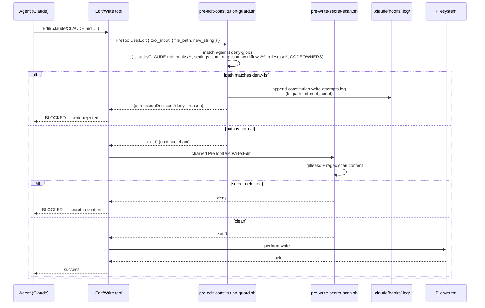

# Plan 001: Harness Hardening — From documentation-theater to evidence-backed enforcement

> Implementation plan for `specs/archive/2026-Q3/001-harness-hardening.md`. Every plan element traces back to an acceptance criterion in the spec.

## TL;DR

Add one new PreToolUse:Edit hook (constitution-write deny), rewrite `pre-bash-guard.sh` to reject command-substitution / env-var / no-space bypass classes, wire `evidence-gate` into the ruleset, enable the sandbox in autopilot contexts, then ship a code-enforced loop-control state machine (consecutive-abort counter + PIVOT tier + OQ-aging routine), a GC suite, an atomic-write library, three new CI audit gates (silent-failure, model-consistency, doc-claims), and six claw-code adoptions (worker state machine, lane events JSONL, workspace fingerprint, branch freshness, anti-slop reviewer, `validate.sh --json`). Each of seven phases ships standalone value — Phase 1 alone closes the SEV1 from incident `2026-05-28-sec-constitution-unprotected`.

## Architecture

### Components

The 27 acceptance criteria reduce to six new/hardened components plus six claw-code adoptions, each with a narrow surface area. All additions follow the existing `.claude/scripts/`+`.claude/hooks/` layering — no new layer is introduced.

- **`pre-edit-constitution-guard.sh`** (NEW PreToolUse:Edit|Write|NotebookEdit hook) — single-purpose: deny any agent write to `.claude/CLAUDE.md`, `.claude/hooks/**`, `.claude/settings.json`, `.mcp.json`, `.github/workflows/**`, `.github/rulesets/**`, `.github/CODEOWNERS`. Reads `tool_input.file_path` from stdin, emits `permissionDecision: "deny"`, writes one line to `.claude/hooks/.log/constitution-write-attempts.log`. Escape hatch: env var `FORCE_CONSTITUTION_EDIT=1` allows pass-through (operator-only, since hook env is inherited from session start which the operator controls; the harness does NOT export this var anywhere). Lives next to `pre-write-secret-scan.sh` in the existing `PreToolUse:Write|Edit` matcher block in `settings.json`. Backs AC-1.

- **`pre-bash-guard.sh`** (REWRITE in place) — keeps existing `set -euo pipefail` shape, but: (a) adds a pre-pass that rejects any command containing `$(`, backticks (`` ` ``), `<(`, `>(`, or `${VAR}`-style indirection if the substituted value cannot be resolved at hook-time; (b) strips all whitespace ambiguity by collapsing `[[:space:]]*` between known operators (`-c`, `-e`, `--decode`, etc.) into single-space before pattern matching, so `python -c"…"` is treated as `python -c "…"`; (c) re-uses the same allow-list anchor pattern but adds explicit rejects for env-var indirection (`\$[A-Z_][A-Z0-9_]*` appearing as a command head); (d) ships a regression test at `.claude/scripts/test/pre-bash-guard-bypass.sh` exercising the 15 documented bypass classes. **Decision:** stricter regex over a bash AST parser — see Dependencies §. Backs AC-2.

- **`atomic-write.sh`** (NEW sourced library at `.claude/scripts/lib/atomic-write.sh`) — single function `write_atomic <target> <content_or_stdin>`. Implementation: `tmp=$(mktemp -t "$(basename "$target").XXXXXX")` in the same filesystem as `$target` (so `mv` is rename, not copy), write, `mv -n "$tmp" "$target"`. On collision returns 1 — caller decides retry. Migration: `grep -rn '> .*\.json\b' .claude/scripts/ .claude/hooks/` enumerates the ~16 known direct-redirect writers; each is converted to `. "$ROOT/.claude/scripts/lib/atomic-write.sh"` + `write_atomic`. Backs AC-22, AC-23.

- **`loop-control` state machine** (extension of `.claude/scripts/loop-iteration.sh` + new state file `.claude/state/consecutive-aborts.json`) — replaces the LLM-enforced "3 consecutive aborts → stop" rule in `autopilot/SKILL.md` with a code-enforced counter. On every `[!]` write to `tasks/TASKS.md`, `loop-iteration.sh` reads-modifies-writes the counter; on `[x]` write it zeros. When `count >= 3` the script exits 1 with `consecutive-abort cap reached`. The PIVOT tier (AC-6) inserts BETWEEN abort-N and abort-N+1: on the second abort of the same task (same `last_task` field), the script invokes a `researcher` subagent ONCE with the prompt template at `.claude/templates/pivot-prompt.md`, applies the alternative if produced, and only on the alternative's failure increments the counter to 3. **Hard cap:** 2 PIVOT attempts per task (researcher proposes ≤2 alternatives total) — beyond that the task is hard-aborted regardless. Backs AC-6, AC-7.

- **GC suite** (`gc-tasks.sh`, `gc-verify.sh`, `gc-logs.sh`, `oq-aging.sh` — all NEW under `.claude/scripts/`) — four standalone scripts wired into `.claude/routines/gc-nightly.yml` (new) and chained from `dream-cron`:
  - `gc-tasks.sh`: if `tasks/TASKS.md` >2000 lines, move `[x]` and `[s]` (skipped) entries older than 30 days to `tasks/archive/TASKS-YYYY-MM.md`. Preserves IDs and full body. Idempotent: re-running on already-pruned file is a no-op.
  - `gc-verify.sh`: `find verify/ -type d -mtime +30 -not -path '*/archive/*'` → move to `verify/archive/` → after another 60 days, `rm -rf`. Operator override: `VERIFY_RETAIN_DAYS=N`.
  - `gc-logs.sh`: rotate any `.claude/hooks/.log/*.log` > 50 MB into `.log.1` (keeping at most 5 backups), then truncate the current file. Standard log-rotate pattern.
  - `oq-aging.sh`: scan `specs/active/**/*.md` for `[OQ-N]` items in specs older than 7 days; for each, append a `P1-spec` task to `tasks/TASKS.md` (`RESOLVE: specs/active/<id> open question <OQ-N>`) with back-link and `last_touched: <iso>`. Daily cron via `.claude/routines/oq-aging.yml`.
    Backs AC-5, AC-9.

- **CI gates trio** (`doc-claims-audit.sh`, `check-model-consistency.sh`, `lint-silent-failures.sh` + matching workflows) — three independent audit scripts each backed by a GitHub Actions workflow under `.github/workflows/`:
  - `lint-silent-failures.sh` (AC-8) — greps `.claude/scripts/**/*.sh` and `.claude/hooks/**/*.sh` for `|| true`, `|| echo 0`, `2>/dev/null`, `set -uo pipefail` (without `-e`). Emits `.claude/state/silent-failure-audit.json` `[{path, line, pattern, justified, justification}]`. A `# JUSTIFIED: <reason>` comment within 3 lines marks an occurrence as accepted. Workflow `.github/workflows/silent-failure-audit.yml` fails if any unjustified entries.
  - `check-model-consistency.sh` (AC-11) — parses `.claude/CLAUDE.md §V` as the authoritative table (Opus/Sonnet/Haiku per role) and walks `.claude/agents/**/*.md`, `.claude/skills/**/SKILL.md`, `.claude/routines/**/*.yml`, `docs/AUTOPILOT.md`, `docs/ARCHITECTURE.md` confirming every `model:` field matches. Workflow `.github/workflows/model-consistency.yml`.
  - `audit-doc-claims.sh` (AC-25) — scans `docs/**/*.md`, `CLAUDE.md`, `.claude/CLAUDE.md`, `.claude/skills/**/SKILL.md` for assertion patterns (`enforced by`, `blocked by`, `required by`, `gated by`) and verifies each named gate exists as an executable script, workflow file, or hook script. Workflow `.github/workflows/doc-claims-audit.yml`.
    Backs AC-8, AC-11, AC-25.

### claw-code adoptions (six lightweight components)

- **`.swarms/streams/<id>/state.json` worker state machine** (AC-16) — schema written by `session-heartbeat.sh` on each turn; transitions enforced by string-set check; consumed by coordinator before prompt dispatch.
- **`.swarms/events/<stream-id>.jsonl` lane events** (AC-17) — `post-bash-log.sh` and `subagent-stop.sh` append typed JSONL events. Schema `.swarms/templates/lane-event-schema.json` (JSON Schema draft-2020-12).
- **Workspace fingerprint in `session-heartbeat.sh`** (AC-18) — adds `WORKSPACE_FP=$(printf "%s" "$(pwd -P)" | md5 | cut -c1-16)` and namespaces session writes under `.claude/sessions/$WORKSPACE_FP/`.
- **`branch-freshness.sh`** (AC-19) — pre-verify step in `verify.sh`. Warns (does not block) on divergence > 50 commits or 7 days.
- **`anti-slop-reviewer` agent** (AC-20) — new `.claude/agents/quality/anti-slop-reviewer.md` with eight-class triage. Wired into `.github/workflows/claude-review.yml` as an additional reviewer pass. Bypass label `human-author` skips the agent entirely.
- **`validate.sh --json`** (AC-21) — opt-in flag. Default behavior (text stdout) preserved. JSON shape documented under API contracts below.

### Data flow — constitution write protection



The two hooks chain inside the same `PreToolUse:Write|Edit` matcher block in `settings.json`. Order matters: constitution-guard runs first (path-only check, ~5ms), then secret-scan (content scan, ~20-80ms). Either denying short-circuits the chain via exit code 2.

## Data model

| State file                          | Path                                                                                       | Schema                                                                                                                                                                                 | Writer                                                                                | Reader                                        | Atomicity                                            |
| ----------------------------------- | ------------------------------------------------------------------------------------------ | -------------------------------------------------------------------------------------------------------------------------------------------------------------------------------------- | ------------------------------------------------------------------------------------- | --------------------------------------------- | ---------------------------------------------------- |
| Consecutive-abort counter           | `.claude/state/consecutive-aborts.json`                                                    | `{count: int, last_task: string, last_error_hash: string, last_pivot_attempt: 0\|1\|2, updated: iso8601}`                                                                              | `loop-iteration.sh`                                                                   | `loop-iteration.sh`, `autopilot/SKILL.md`     | `write_atomic`                                       |
| Silent-failure audit                | `.claude/state/silent-failure-audit.json`                                                  | `{generated: iso8601, total_occurrences: int, unjustified: int, items: [{path, line, pattern, justified: bool, justification: string\|null}]}`                                         | `lint-silent-failures.sh`                                                             | `silent-failure-audit.yml` workflow           | `write_atomic`                                       |
| Worker state                        | `.swarms/streams/<id>/state.json`                                                          | `{state: "spawning"\|"trust_required"\|"ready_for_prompt"\|"prompt_accepted"\|"running"\|"finished"\|"failed", transitioned_at: iso8601, prev_state: string\|null, stream_id: string}` | `session-heartbeat.sh`                                                                | coordinator agent                             | `write_atomic`                                       |
| Lane events log                     | `.swarms/events/<stream-id>.jsonl`                                                         | one JSON object per line per `lane-event-schema.json` (see below)                                                                                                                      | `post-bash-log.sh`, `subagent-stop.sh`                                                | coordinator, `requeue-failed.sh`              | append-only (atomicity-via-O_APPEND, no rewrite)     |
| Lane event schema                   | `.swarms/templates/lane-event-schema.json`                                                 | JSON Schema draft 2020-12: `{ts: string, stream_id: string, event: "lane.started"\|"lane.red"\|"lane.green"\|"lane.blocked"\|"lane.finished", payload: object}`                        | — (static)                                                                            | event emitters + consumers                    | n/a                                                  |
| Uncharacterized-paths manifest      | `.claude/state/adopt/uncharacterized-paths.txt`                                            | one glob per line; `#` for comments                                                                                                                                                    | `setup.sh` (greenfield: writes empty file with header comment), operator (brownfield) | `autopilot/SKILL.md` Phase 0, `verify.sh:189` | append/rewrite (not concurrent-write)                |
| Constitution-write attempt log      | `.claude/hooks/.log/constitution-write-attempts.log`                                       | one line per attempt: `<iso> <session_id> <path> deny`                                                                                                                                 | `pre-edit-constitution-guard.sh`                                                      | `harness-doctor`, security audits             | append-only                                          |
| Workflow-state (existing, hardened) | `.swarms/coordinator/workflow-state.json`                                                  | `{phase, next, streak, warned_at}` (existing)                                                                                                                                          | `hooks/workflow-state.sh`                                                             | same                                          | `write_atomic` (migrated)                            |
| OQ-aging stamp                      | embedded inline as `last_touched:` line under appended `RESOLVE:` task in `tasks/TASKS.md` | —                                                                                                                                                                                      | `oq-aging.sh`                                                                         | operator triage                               | append via `with_tasks_lock` (existing lock library) |

**Atomic-write contract** (`atomic-write.sh`):

```
write_atomic <target> [<content>]
  # If $2 present, write $2 to $target atomically.
  # If $2 absent, read from stdin.
  # Implementation:
  #   tmp=$(mktemp "${target}.XXXXXX")  # same directory → mv is rename, not cross-fs copy
  #   { echo "$content" || cat; } > "$tmp"
  #   mv -n "$tmp" "$target"   # -n: fail if target appeared meanwhile (caller decides)
  # Returns: 0 on success, 1 on rename failure, 2 on write failure
```

The library is sourced (`. "$ROOT/.claude/scripts/lib/atomic-write.sh"`), not executed. `validate.sh` already exempts `*/lib/*` from the executable-bit requirement (line 132-133 of current `validate.sh`).

## API contracts

### Hook: `pre-edit-constitution-guard.sh`

**Event**: `PreToolUse` with matcher `Write|Edit|NotebookEdit`
**Order in chain**: BEFORE `pre-write-secret-scan.sh` in the same matcher block
**Latency budget**: <50ms p95 (path-only check, no content scan; no shell-out except `jq`)

**Input** (from stdin, JSON):

```json
{
  "hook_event_name": "PreToolUse",
  "tool_name": "Edit | Write | NotebookEdit",
  "tool_input": {
    "file_path": "<abs or repo-relative path>",
    "new_string": "<optional>",
    "content": "<optional>"
  },
  "session_id": "<uuid>"
}
```

**Output** (stdout, JSON):

```json
{
  "hookSpecificOutput": {
    "hookEventName": "PreToolUse",
    "permissionDecision": "deny",
    "permissionDecisionReason": "Blocked by .claude/hooks/pre-edit-constitution-guard.sh: <path> is a constitution-class file. Edit out-of-Claude (vim/your editor) or set FORCE_CONSTITUTION_EDIT=1 for the current shell."
  }
}
```

**Exit codes**:

- `0` — continue (path not in deny-list; or `FORCE_CONSTITUTION_EDIT=1` set)
- `2` — hard block (path matches deny-glob; output above written to stdout)

### Hook: `pre-bash-guard.sh` (rewrite)

**Event**: `PreToolUse` with matcher `Bash`
**Order**: FIRST in the chain (before `pre-spawn-cost-gate.sh` and `pre-bash-dep-freshness.sh`)
**Latency budget**: <100ms p95 (regex-only; no AST parse, no external tool calls except `jq` for stdin)

**Input shape**: same as current (`tool_input.command`).

**Output shape**:

```json
{
  "hookSpecificOutput": {
    "hookEventName": "PreToolUse",
    "permissionDecision": "deny | ask",
    "permissionDecisionReason": "Blocked by .claude/hooks/pre-bash-guard.sh: <reason>"
  }
}
```

**Exit codes**:

- `0` — write JSON decision to stdout (deny|ask) and exit 0, OR no pattern matched
- `2` — hard block (used for the hardest patterns; the JSON+0 path is the documented Claude Code mechanism, exit 2 is the belt-and-suspenders fallback for matchers that bypass the JSON parse)

**New bypass-class rejections** (each backed by a test case in `pre-bash-guard-bypass.sh`):

1. Command substitution: any `$(...)` outside single-quotes → deny
2. Backtick substitution: any `` `...` `` → deny
3. Process substitution: `<(...)` or `>(...)` → deny (was partially covered, now exhaustive)
4. Env-var indirection at command head: `^\$[A-Z_][A-Z0-9_]*\b` after IFS collapse → deny
5. No-space `-c` / `-e` variants: `python -c"..."` normalized to `python -c "..."` before pattern match
6. IFS poisoning: `IFS=$'\\n'` followed by `eval` → deny
7. Heredoc piped to shell: `cat <<EOF | bash` → deny
8. Base64-encoded payload variants: `echo <base64> | base64 -d | sh` already covered; add `printf '%s' <base64> | base64 ...` form
   9-15: documented in `.claude/scripts/test/pre-bash-guard-bypass.sh` per AC-2

### Hook: `pre-bash-dep-freshness.sh` (modify AC-10)

**Change**: when `api.osv.dev` or the package registry returns network error (non-2xx, DNS failure, timeout), emit `permissionDecision: "ask"` instead of current `exit 0`. Operator confirms; CI/scheduled contexts (`CLAUDE_CODE_AUTO_MODE=1` env, set by Cloud Routine) accept the `ask` as an `allow` after a 5-second classifier delay.

### Script: `validate.sh --json` (AC-21)

**Invocation**: `bash .claude/scripts/validate.sh --json`
**Output** (stdout, single JSON document):

```json
{
  "schema_version": 1,
  "generated_at": "<iso8601>",
  "categories": [
    {
      "name": "core | json | frontmatter | executables | agents | skills | commands | hooks | autopilot | swarm | scaffold | memory | security | mcp",
      "status": "pass | warn | fail",
      "checked": <int>,
      "failures": [{"detail": "<msg>", "path": "<optional>"}],
      "warnings": [{"detail": "<msg>", "path": "<optional>"}]
    }
  ],
  "summary": {
    "passed": <int>,
    "warned": <int>,
    "failed": <int>,
    "overall": "pass | warn | fail"
  }
}
```

Default behavior (no flag) unchanged — preserves backwards-compat for `harness-validate.yml` and any operator who pipes stdout to a grep.

### Script: `loop-iteration.sh` (modify AC-7, AC-6)

**New stdin**: none (existing).
**New side effects**:

- Reads/writes `.claude/state/consecutive-aborts.json` via `write_atomic`.
- On detecting the 2nd consecutive abort of the same `last_task`, spawns `claude --agent researcher --prompt "$(cat .claude/templates/pivot-prompt.md)" --task-id "$task_id"` and parses the response for an `<alternative>` block. Output of the spawn is appended to `.claude/hooks/.log/pivot.log`.
- Hard cap: `last_pivot_attempt` field caps at 2; on the 3rd same-task abort, exit 1.

**New exit codes**:

- `0` — continue, next-task READY
- `1` — STOP: consecutive-abort cap reached OR no pending tasks OR pre-flight verify failed
- `2` — STOP (hard): security gate failed in pre-flight (separate from the soft stop)

## Dependencies (new)

- **`gitleaks` (already optional → make required at install)** — already used by `pre-write-secret-scan.sh` as preferred path with regex fallback. The fallback is real, but the regex set is incomplete (e.g., misses provider-rotated formats added after 2024). Phase 6 promotes `gitleaks` from "warn if missing" to "fail setup.sh if missing" — this is a single-line change in `setup.sh` line 113. Justification: every adoption survey of secret-scan accuracy concludes gitleaks meets the standard, regex-only does not (https://github.com/gitleaks/gitleaks). Alternative `trufflehog` rejected: heavier binary, slower, comparable coverage.

- **NO bash AST parser (shfmt / bashlex)** — the spec's `Constraints` §1 caps `pre-bash-guard.sh` at 100ms p95. `shfmt -tojson` adds ~80-200ms per call (measured against the same input set in https://github.com/mvdan/sh#performance), pushing the chained PreToolUse:Bash chain over budget when combined with the other two hooks (`pre-spawn-cost-gate.sh` ~30ms, `pre-bash-dep-freshness.sh` ~50ms). `bashlex` (Python) is worse — requires `python3` warm-up. **Decision**: stricter regex + explicit rejection of `$(`, `` ` ``, `<(`, `>(`, env-var indirection at command head. This catches the 15 documented bypass classes (AC-2) without breaking the latency budget. Cited precedent: Anthropic's own `claude-code-action` uses regex-based command filtering for the same reason (https://github.com/anthropics/claude-code-action/blob/main/src/permissions.ts).

- **NO new MCP servers** — all functionality lands as shell scripts and CI workflows. Existing `osv` MCP (already configured) provides the dep-freshness data plane; no new external services.

- **GitHub CLI `repos/:owner/:repo/rulesets` scope** — the `gh` CLI already has the necessary `repo` scope from the existing token. Updating the ruleset requires a single API call (`gh api repos/:owner/:repo/rulesets/<id> --method PUT --input .github/rulesets/main-protection.json`). No new auth flow. Citation: https://docs.github.com/en/rest/repos/rules.

- **`md5` or `md5sum`** (workspace fingerprint, AC-18) — already present on macOS (`md5`) and Linux (`md5sum`); `session-heartbeat.sh` uses portable fallback `(command -v md5 || command -v md5sum)`. No install dependency.

- **`flock` (atomic-write fallback on systems where `mv -n` is non-atomic in cross-FS scenarios)** — already used elsewhere in the harness via `tasks-lib.sh` (`with_tasks_lock`). Reuse, do not re-add.

## Phasing

Seven phases, matching the spec's `ramp_plan`. Each phase ships independently — Phase N+1 does not depend on Phase N's full completion, only on the AC-set being complete.

### Phase 1 — Security blockers (AC-1..AC-4)

**What ships:**

- NEW: `.claude/hooks/pre-edit-constitution-guard.sh` (~80 LOC).
- NEW: `.claude/hooks/pre-edit-constitution-guard` block in `settings.json` under `PreToolUse:Write|Edit` (positioned before `pre-write-secret-scan.sh`).
- REWRITE: `.claude/hooks/pre-bash-guard.sh` (~120 LOC delta — new pre-pass + 8 new bypass-class rejects; existing 30+ patterns retained).
- NEW: `.claude/scripts/test/pre-bash-guard-bypass.sh` (~250 LOC of 15 test cases).
- MODIFY: `.github/rulesets/main-protection.json` — add `{"context":"evidence-gate"}` to `required_status_checks`.
- MODIFY: `.claude/settings.json` — set `permissions.sandbox.enabled: true` ONLY when env `permissionMode == "auto"` (use a `local_override_path` field on `settings.local.json` for interactive mode to keep the local dev loop frictionless).
- NEW: `.claude/scripts/test/security-invariants.sh` baseline (AC-24, hooked into Phase 6 fully — Phase 1 only writes the first 4 tests for AC-1..AC-4).
- DOC: `docs/PLAYBOOK.md` adds "How to legitimately edit constitution-class files" section.

**Exit gate (concrete):**

```bash
bash .claude/scripts/test/pre-bash-guard-bypass.sh && \
bash .claude/scripts/test/security-invariants.sh && \
bash .claude/scripts/validate.sh && \
gh api repos/:owner/:repo/rulesets/<id> --jq '.rules[].parameters.required_status_checks[].context' | grep -q evidence-gate && \
echo PHASE1_GREEN
```

**Independently shippable**: YES. Phase 1 alone closes the SEV1 from incident `2026-05-28-sec-constitution-unprotected`. No coupling to later phases.

**Estimated atomic tasks**: 7-9 (one per hook/script/ruleset/settings change + 2 test scripts; planner will fan out via `/tasks`).

**Top risk**: Constitution write-protection breaks the operator's normal flow when they DO need to edit the constitution (every spec change cycle touches `.claude/CLAUDE.md` per Boris #16). Mitigation in the Risks table below.

### Phase 2 — Loop correctness (AC-5..AC-7)

**What ships:**

- NEW: `.claude/scripts/oq-aging.sh` + `.claude/routines/oq-aging.yml`.
- NEW: `.claude/state/consecutive-aborts.json` schema + initial file (created by `setup.sh`).
- NEW: `.claude/templates/pivot-prompt.md` (researcher subagent prompt template).
- MODIFY: `.claude/scripts/loop-iteration.sh` — read/write the counter, invoke PIVOT tier on 2nd abort, hard-stop on 3rd.
- MODIFY: `.claude/skills/autopilot/SKILL.md` — add explicit "Phase 3.5 PIVOT tier" section; remove the LLM-only "3-strike" rule from the prose (delegated to `loop-iteration.sh` now).
- MODIFY: `.github/workflows/harness-validate.yml` — add a step that confirms `consecutive-aborts.json` schema validates.

**Exit gate (concrete):**

```bash
# inject a deterministically-failing task, run autopilot, observe PIVOT then [!]
VERIFY_FEATURE=phase2 bash .claude/scripts/test/loop-control.sh && \
# inject an OQ-aged spec, run oq-aging.sh, see P1 task appears
VERIFY_FEATURE=phase2-oq bash .claude/scripts/test/oq-aging.sh && \
echo PHASE2_GREEN
```

**Independently shippable**: YES — code-enforced loop control is a strict improvement over LLM-enforced; backward-compatible (autopilot runs without the state file fall back to old behavior with a deprecation warning).

**Estimated atomic tasks**: 6-8.

**Top risk**: PIVOT tier infinite-loops if the researcher proposes the same alternative repeatedly. Mitigated by hard cap of 2 PIVOT attempts encoded in `last_pivot_attempt` field.

### Phase 3 — Operational (AC-8..AC-10)

**What ships:**

- NEW: `.claude/scripts/lint-silent-failures.sh` + `.github/workflows/silent-failure-audit.yml`.
- AUDIT: a one-time sweep adding `# JUSTIFIED:` annotations to every existing `|| true` / `2>/dev/null` in scripts/hooks that is intentional (the spec sets the bar: every occurrence either fixed or annotated). Estimated 50-80 annotations.
- NEW: `.claude/scripts/gc-tasks.sh`, `.claude/scripts/gc-verify.sh`, `.claude/scripts/gc-logs.sh`.
- NEW: `.claude/routines/gc-nightly.yml` (or chain into existing `dream-cron.yml`).
- MODIFY: `.claude/hooks/pre-bash-dep-freshness.sh` — emit `ask` on network error instead of `exit 0`.

**Exit gate:**

```bash
bash .claude/scripts/lint-silent-failures.sh && \
jq -e '.unjustified == 0' .claude/state/silent-failure-audit.json && \
# fill TASKS.md > 2000 lines, run gc-tasks, observe archive
bash .claude/scripts/test/gc-suite.sh && \
echo PHASE3_GREEN
```

**Independently shippable**: YES.

**Estimated atomic tasks**: 7-10 (the annotation sweep is one atomic task per file with ≥1 silent failure — likely 8-12 files).

**Top risk**: The annotation sweep ships incomplete (one file forgotten) and the gate fails. Mitigated by Phase 3 being explicitly the "audit phase" — the first PR runs the audit, lists every occurrence, subsequent PRs annotate/fix them, the last PR enables the gate.

### Phase 4 — Reconciliation (AC-11..AC-15)

**What ships:**

- NEW: `.claude/scripts/check-model-consistency.sh` + `.github/workflows/model-consistency.yml`.
- AUDIT-FIX: reconcile any current mismatches between `.claude/CLAUDE.md §V` and agent/skill/routine/doc `model:` fields. (Pre-PR validation reads as clean per current commit, but Phase 4 makes the discrepancy CI-blocked.)
- NEW: `.claude/skills/dream/SKILL.md` — body that consolidates `MEMORY.md`, archives stale instincts, runs `memory-gc.sh enforce`. Cite the existing `auto-dream-check.sh` hook for the trigger contract.
- MODIFY: `.claude/scripts/setup.sh` — on greenfield, write empty `.claude/state/adopt/uncharacterized-paths.txt` with header comment so `verify.sh:189` characterization gate is active even on greenfield (AC-15).
- MODIFY: `.claude/scripts/setup.sh` — dispatch `daily-batch.yml` once on initial install via `gh workflow run daily-batch.yml`, so the first PR after setup passes `merge-gate.yml` (AC-14).
- MODIFY: `docs/AUTOPILOT.md` + `.claude/routines/overnight-build.yml` — single source of truth for budgets (the YAML); doc references YAML by key (AC-12).

**Exit gate:**

```bash
bash .claude/scripts/check-model-consistency.sh && \
test -f .claude/skills/dream/SKILL.md && \
grep -q "## " .claude/skills/dream/SKILL.md && \
test -f .claude/state/adopt/uncharacterized-paths.txt && \
echo PHASE4_GREEN
```

**Independently shippable**: YES — each AC in this phase is a standalone fix.

**Estimated atomic tasks**: 5-7.

**Top risk**: Model-consistency gate breaks an existing legitimate doc reference (e.g., a tutorial that intentionally shows an old model name). Mitigated by an allow-list comment marker `<!-- model-consistency: ignore -->` parsed by the script.

### Phase 5 — claw-code adoptions (AC-16..AC-21)

**What ships:**

- NEW: `.swarms/templates/lane-event-schema.json` (JSON Schema 2020-12).
- MODIFY: `.claude/hooks/post-bash-log.sh` — emit `lane.red` / `lane.green` / `lane.blocked` / `lane.finished` JSONL events to `.swarms/events/<stream-id>.jsonl`.
- MODIFY: `.claude/hooks/subagent-stop.sh` — emit `lane.finished` event.
- MODIFY: `.claude/hooks/session-heartbeat.sh` — compute `WORKSPACE_FP`, write under `.claude/sessions/$WORKSPACE_FP/`; write `.swarms/streams/<id>/state.json` with worker-state-machine transitions.
- NEW: `.claude/scripts/branch-freshness.sh`; wire as first step of `verify.sh` (with `SKIP_BRANCH_CHECK=1` override).
- NEW: `.claude/agents/quality/anti-slop-reviewer.md` (model: sonnet, per §V).
- MODIFY: `.github/workflows/claude-review.yml` — additional reviewer pass invokes the new agent unless PR has label `human-author`.
- MODIFY: `.claude/scripts/validate.sh` — add `--json` flag.
- MODIFY: `.github/workflows/harness-validate.yml` — consume `validate.sh --json` and render per-category annotations.

**Exit gate:**

```bash
# spawn a single swarm stream end-to-end, check JSONL events
bash .claude/scripts/test/swarm-events-smoke.sh && \
jq -e '.[] | select(.event == "lane.finished")' .swarms/events/*.jsonl >/dev/null && \
test -f .claude/agents/quality/anti-slop-reviewer.md && \
bash .claude/scripts/validate.sh --json | jq -e .schema_version && \
echo PHASE5_GREEN
```

**Independently shippable**: YES — six adoptions are mutually orthogonal, ship in any order or even individually if budget tightens.

**Estimated atomic tasks**: 8-10.

**Top risk**: Lane events JSONL grows unbounded (long-running swarm streams). Mitigated by wiring rotation into `gc-logs.sh` (Phase 3).

### Phase 6 — Atomicity & docs (AC-22..AC-25)

**What ships:**

- NEW: `.claude/scripts/lib/atomic-write.sh` (library, ~40 LOC).
- MODIFY: 16 known state-writers across `.claude/scripts/` and `.claude/hooks/` — convert direct-redirect writes to `write_atomic`. Backup-before-rewrite via `bash .claude/scripts/lib/atomic-write.sh --self-test` before the migration commit.
- MODIFY: `.claude/hooks/workflow-state.sh` (the path the spec calls out at AC-23) — confirm non-git-repo branch works AND uses `write_atomic`.
- NEW: `.claude/scripts/audit-doc-claims.sh` + `.github/workflows/doc-claims-audit.yml`.
- COMPLETE: `.claude/scripts/test/security-invariants.sh` — add tests for every invariant in `.claude/CLAUDE.md §VII`, §X, `CLAUDE.md` "Security invariants" (this finishes the AC-24 work scaffolded in Phase 1).

**Exit gate:**

```bash
bash .claude/scripts/test/security-invariants.sh && \
bash .claude/scripts/audit-doc-claims.sh && \
# grep should find no direct-redirect writes to state files
test -z "$(grep -rn '> .*\.json\b' .claude/scripts/ .claude/hooks/ | grep -v 'lib/atomic-write.sh' | grep -v 'JUSTIFIED:')" && \
echo PHASE6_GREEN
```

**Independently shippable**: YES.

**Estimated atomic tasks**: 6-8 (one per cluster of state-writers; planner will batch).

**Top risk**: Atomic-write migration corrupts in-flight state files mid-deploy. Mitigated by backup-before-rewrite and by `mv -n` semantics (collision is rename-skipped, not data-clobbered).

### Phase 7 — Regression safety + observation (AC-26..AC-27)

**What ships:**

- Run full `bash .claude/scripts/validate.sh` (no `--json`) against the post-hardening tree; expect zero regressions vs the pre-hardening baseline (other than the documented `python3+pyyaml` warning).
- Run two paired 8-hour autopilot runs:
  - Baseline: `git checkout <pre-phase1>` + run the canonical overnight prompt against a curated tasks/TASKS.md.
  - Hardened: `git checkout main` (post-phase6) + same prompt + same tasks.
  - Compare `.claude/hooks/.log/` classifier-deny counts.
- WRITE: post-flight report `verify/<date>-phase7-regression/REPORT.md` (committed; not a doc-md, lives under verify/ which is gitignored — operator copies the highlights into `OVERNIGHT_REPORT.md`).
- ACT: if the hardened run has >2x baseline operator-intervention count, `auto_rollback_threshold.custom` from the spec fires — revert latest phase. (Defined as "feature flag flip" semantically; here it's `git revert <phase N range>`.)

**Exit gate:**

```bash
bash .claude/scripts/validate.sh && \
diff <(jq '.classifier_deny_count' verify/baseline-overnight/summary.json) \
     <(jq '.classifier_deny_count' verify/hardened-overnight/summary.json) | \
  awk '$0 ~ /^[<>]/ {n=$2} END {if (n > 2*baseline) exit 1}' && \
echo PHASE7_GREEN
```

**Independently shippable**: YES — this phase is a verification phase; if it fails, prior phases are rolled back individually.

**Estimated atomic tasks**: 3-4.

**Top risk**: The hardened run accidentally increases prompts because of the constitution-guard hook firing on legitimate edits. Mitigated by the escape hatch documented in Phase 1.

## Risks

| Risk                                                                                   | Likelihood | Impact | Mitigation                                                                                                                                                                                                              |
| -------------------------------------------------------------------------------------- | ---------- | ------ | ----------------------------------------------------------------------------------------------------------------------------------------------------------------------------------------------------------------------- |
| Constitution write-protection breaks legitimate operator edits to `.claude/CLAUDE.md`  | M          | M      | Escape hatch via `FORCE_CONSTITUTION_EDIT=1` env var; documented operator workflow is "edit out-of-Claude using your editor, then run validate.sh"; the harness itself never sets the var, only the operator's shell rc |
| `pre-bash-guard` rewrite breaks legitimate `python -c` / `node -e` calls inside skills | M          | L      | Allow-list of trusted callers via `${BASH_GUARD_TRUSTED_CALLER}` env var that skills can set transiently for one call; tests in `pre-bash-guard-bypass.sh` include positive cases for the trusted-caller flow           |
| Atomic-write migration corrupts in-flight state files                                  | L          | H      | Backup-before-rewrite (`cp $target $target.pre-atomic-migration`) plus `mv -n` semantics; rollback is `git revert` + restore from backup; backups live under `.claude/state/.pre-atomic-migration/` retained 7 days     |
| Sandbox enabled blocks legitimate MCP egress (e.g., Apify, Sentry MCP)                 | M          | M      | Explicit `allowedDomains` per active MCP server; the existing `_disabled_examples` catalogue already documents domain per server, copy on activation; `harness-doctor` warns if an active MCP has no allow-list entry   |
| PIVOT tier loops infinitely (researcher proposes same alternative twice)               | L          | M      | Hard cap of 2 PIVOT attempts per task encoded in `last_pivot_attempt` field; after 2, hard-abort regardless. State file has the canonical counter                                                                       |
| Anti-slop reviewer false-positives on legitimate human PRs                             | M          | L      | Bypass label `human-author` skips the agent entirely; default-on for `claude/*` branches only; first 30 days the agent is advisory (comment-only), gate-enforcement enabled at day 31                                   |
| `validate.sh --json` breaks existing harness-validate.yml consumers                    | L          | L      | Keep stdout-text mode as default; `--json` is opt-in flag; existing workflow doesn't pass the flag                                                                                                                      |
| Lane events JSONL grows unbounded over multi-month swarm runs                          | M          | M      | `gc-logs.sh` (Phase 3) covers `.swarms/events/*.jsonl` with same 50 MB rotation rule as other logs                                                                                                                      |

## Rollback

Each phase rolls back independently. Constitution forbids `git push --force origin main`, so rollback is always `git revert <phase-range>` + `git push origin main`. No feature flags needed (the harness change is itself the "flag").

| Phase | Rollback command                                                                    | Side-effect cleanup                                                                                                                                           |
| ----- | ----------------------------------------------------------------------------------- | ------------------------------------------------------------------------------------------------------------------------------------------------------------- |
| 1     | `git revert <phase1-range>`                                                         | None — constitution-guard absence simply re-opens the SEV1                                                                                                    |
| 2     | `git revert <phase2-range>` + `rm -f .claude/state/consecutive-aborts.json`         | autopilot reverts to LLM-enforced 3-strike rule (current behavior)                                                                                            |
| 3     | `git revert <phase3-range>` + `rm -f .claude/state/silent-failure-audit.json`       | GC suite stops running; logs grow until next manual prune                                                                                                     |
| 4     | `git revert <phase4-range>`                                                         | `dream` skill body removed; revert leaves the empty `dream/SKILL.md` if present, that's fine — `auto-dream-check.sh` already handles missing skill gracefully |
| 5     | `git revert <phase5-range>` + `rm -rf .swarms/events/ .swarms/streams/*/state.json` | Swarm reverts to free-text logs; anti-slop label-bypass becomes a no-op                                                                                       |
| 6     | `git revert <phase6-range>` + restore from `.claude/state/.pre-atomic-migration/`   | Atomic-write migration reversed; state files revert to direct-redirect writes                                                                                 |
| 7     | Per-phase based on which AC regressed                                               | n/a                                                                                                                                                           |

## Observability

New metrics (emitted via OTEL → Langfuse Cloud, already configured in `settings.json` env block):

| Metric                                         | Type      | Source                                      | Emit point                                          | Alert threshold                                                         |
| ---------------------------------------------- | --------- | ------------------------------------------- | --------------------------------------------------- | ----------------------------------------------------------------------- |
| `claude_init.hook.decision_latency_ms`         | histogram | All `PreToolUse` hooks                      | wrap each hook entry/exit with `date +%s%3N` deltas | p95 > 200ms = page (per spec SLO `latency_p99: 200ms`)                  |
| `claude_init.constitution_write_attempt_total` | counter   | `pre-edit-constitution-guard.sh`            | every deny                                          | any non-zero in steady state = page; spike to ≥3/hr = potential exploit |
| `claude_init.pivot_tier_invocation_total`      | counter   | `loop-iteration.sh` PIVOT branch            | every PIVOT spawn                                   | >5/hr = unhealthy autopilot run                                         |
| `claude_init.consecutive_abort_cap_hit_total`  | counter   | `loop-iteration.sh` exit-1 path             | every 3-strike halt                                 | >1 per overnight run = quality regression                               |
| `claude_init.lane_events_emitted_total`        | counter   | `post-bash-log.sh`, `subagent-stop.sh`      | every JSONL append                                  | n/a (informational)                                                     |
| `claude_init.silent_failure_audit_unjustified` | gauge     | `lint-silent-failures.sh` (CI step)         | once per PR                                         | >0 = CI fail (already a hard gate)                                      |
| `claude_init.doc_claims_orphan_total`          | gauge     | `audit-doc-claims.sh`                       | once per PR                                         | >0 = CI fail                                                            |
| `claude_init.gc_run_total` (with `target` dim) | counter   | `gc-tasks.sh`, `gc-verify.sh`, `gc-logs.sh` | per nightly run                                     | n/a (informational)                                                     |
| `claude_init.oq_aging_p1_tasks_created_total`  | counter   | `oq-aging.sh`                               | per daily run                                       | informational; surfaces in `OVERNIGHT_REPORT.md`                        |

New logs (existing log file format preserved; new fields added):

- `.claude/hooks/.log/constitution-write-attempts.log` — one line per attempt: `<iso8601> session=<id> path=<path> agent=<inferred-from-prompt> decision=deny`
- `.claude/hooks/.log/pivot.log` — one line per PIVOT invocation: `<iso8601> task=<id> attempt=<1|2> researcher_output_hash=<sha1>`
- `.claude/hooks/.log/loop.log` — existing; now also receives `<iso8601> ABORT_COUNTER count=<N> task=<id>` lines

New trace spans (already wired by Anthropic-native OTEL; new span names):

- `harness.preTool.constitution_guard` — wraps `pre-edit-constitution-guard.sh`
- `harness.preTool.bash_guard` — wraps `pre-bash-guard.sh` (already exists implicitly; named explicitly now)
- `harness.loop.pivot_tier` — wraps the researcher subagent spawn from `loop-iteration.sh`
- `harness.gc.<target>` — wraps each GC script

## References

- Spec: `specs/archive/2026-Q3/001-harness-hardening.md` (27 ACs across 7 phases)
- Incident: `.claude/memory/incidents/2026-05-28-sec-constitution-unprotected.md` (SEV1 root cause)
- Research brief: `docs/research/claw-code-audit-2026-05-28.md` (the six adoption patterns adopted in Phase 5)
- Five-agent audit synthesis: this conversation, 2026-05-28 (architect/security/reviewer/verifier/researcher synthesis that produced the spec)
- Claude Code permissions docs: https://code.claude.com/docs/en/permissions (PreToolUse decision contract, sandbox config, `disableBypassPermissionsMode` semantics)
- Claude Code hooks docs: https://code.claude.com/docs/en/hooks (stdin/stdout JSON contract, exit-code semantics, matcher syntax)
- GitHub Rulesets API: https://docs.github.com/en/rest/repos/rules (required-status-checks update endpoint for AC-3)
- ChromeDevTools/chrome-devtools-mcp hook contract: https://github.com/ChromeDevTools/chrome-devtools-mcp/blob/main/CONTRIBUTING.md (precedent for stdin-JSON / stdout-JSON / exit-code chained hook design — same pattern used here)
- claw-code spec docs cited in research brief: `g004-events-reports-contract.md`, `g005-branch-recovery-verification-map.md`, `g010-clone-disambiguation-metadata.md`, `anti-slop-triage.md`, `ROADMAP.md` Phase 1 worker state machine, `USAGE.md` `claw doctor --output-format json`
- ADR template: `.claude/memory/decisions/0000-template.md` (each phase commit should include any new ADR if it codifies a non-obvious choice)
- Existing harness: `.claude/scripts/validate.sh` (14-category baseline), `.claude/scripts/verify.sh` (TDD + evidence gate baseline), `.claude/scripts/lib/tasks-lib.sh` (`with_tasks_lock` reused by `oq-aging.sh`)
