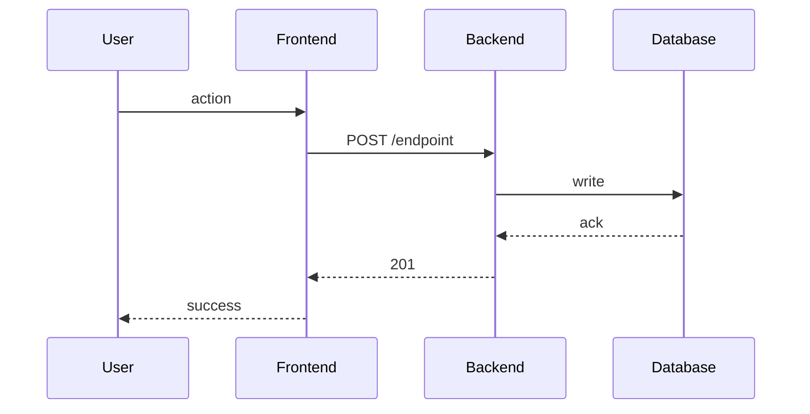

# Plan <NNN>: <Title>

> Implementation plan for `specs/active/<NNN>-<slug>.md`. Every plan element traces back to an acceptance criterion in the spec.

## TL;DR

<2 sentences: what we're building and how>

## Architecture

### Components

- **<component>** — <what it does, where it lives, what it talks to>
- **<component>** — ...

### Data flow



## Data model

| Entity | Fields | Indexes | Migrations |
|---|---|---|---|
| `users` | id, email, created_at | (email) UNIQUE | 2026_05_27_add_users |

## API contracts

### POST /api/v1/<endpoint>

**Auth**: required (Bearer token)
**Rate limit**: 30/min/user

Request:
```json
{ "field": "value" }
```

Response (201):
```json
{ "id": "...", "field": "value" }
```

Errors:
- 400 `{"error":"validation","fields":["..."]}`
- 401 `{"error":"unauthorized"}`
- 429 `{"error":"rate_limited"}`

## Dependencies (new)

- **<package>@<version>** — <justification + URL>
- **<service>** — <justification + URL>
- **<MCP server>** — <justification + URL>

## Phasing

### Phase 1 — <title>
**Exit criteria**: <one-line, machine-verifiable>
- Component A scaffolded
- Migration applied to test DB
- Unit tests for <module> pass

### Phase 2 — <title>
**Exit criteria**: <one-line>
- API endpoint live behind feature flag
- Integration test for happy path passes
- Verified manually

### Phase 3 — <title>
**Exit criteria**: <one-line>
- Feature flag default-on
- E2E test for full user journey passes
- Docs + CHANGELOG updated

Each phase must independently ship-able (deployable, no half-states).

## Risks

| Risk | Likelihood | Impact | Mitigation |
|---|---|---|---|
| Migration locks table for > 30s | M | H | run migration with `CONCURRENTLY`, off-peak |
| New dep adds 200KB to bundle | L | M | tree-shake; lazy-load |
| ... | | | |

## Rollback

- Phase 1: `git revert <sha>` + `alembic downgrade -1`
- Phase 2: feature flag off (no migration revert needed)
- Phase 3: feature flag off, then `git revert`

## Observability

- Metric: `<name>` — what it measures, where it's emitted
- Log: `<message format>` — where, when
- Trace span: `<operation name>` — where it wraps

## References

- Spec: specs/active/<NNN>-<slug>.md
- ADRs cited: ADR-XXXX, ADR-YYYY
- External docs: <url>
- Research brief: docs/research/<date>-<topic>.md
